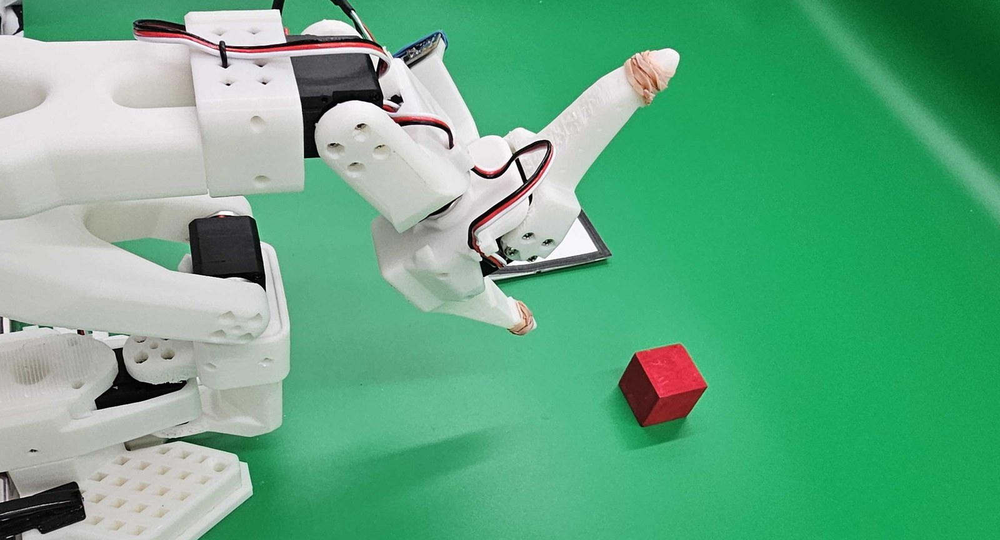
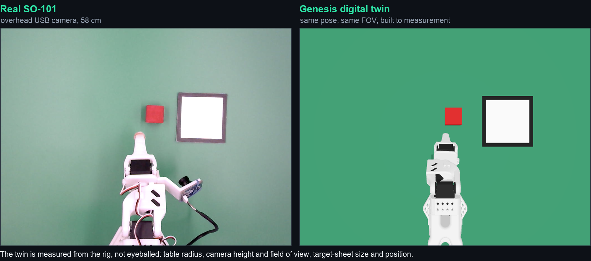
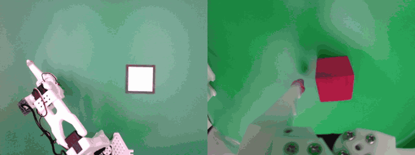
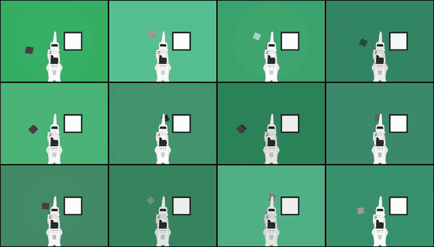

# 35 Minutes to a New Task — Sim2Real for low-cost arms, verified on the physical robot

**Track 3 (Physical AI) · AMD AI DevMaster Hackathon**
Genesis · LeRobot ACT · AMD Radeon GPU / ROCm · SO-101

A $150 arm is affordable to buy and expensive to teach. Imitation learning wants ~50
demonstrations per task, which on real hardware is **2-3 hours of a person driving a leader
arm — for every task, every changed object, every moved camera**. That recurring cost, not
the hardware price, is what keeps small factories, labs and classrooms from putting these
arms to work.

This project moves that cost into simulation: a digital twin measured from the rig, a scripted
expert generating demonstrations for free, ACT trained on one AMD Radeon GPU, and human time
spent only on the **10 episodes — about 35 minutes** — that anchor the policy to reality.



<sub>The hardware, unretouched: 3D-printed links, Feetech STS3215 servos, exposed wiring,
rubber bands round the fingertips for grip. This is what a $150 arm is, and what the policy
has to work with.</sub>



<sub>The real overhead camera and its Genesis twin, same scene. Centre-cropped to a common
aspect, otherwise unmodified ([originals](docs/media/real_arm_world.png)
· [twin](docs/media/sim_arm_world.png)).</sub>

### In 60 seconds

| | |
|---|---|
| **Result** | **85% success on the physical SO-101** (17/20) from **10 real demonstrations** (~35 min of human time) + 50 simulated ones |
| **The control arm** | The same 10 real episodes *without* simulated pretraining: 25% (5/20). Fisher exact **p = 0.00033** |
| **On the GPU** | Simulation stepping, camera rendering, ACT training and closed-loop inference — all on one Radeon (`gs.amdgpu` + ROCm) |
| **Watch** | [`docs/demo_video.mp4`](docs/demo_video.mp4) — 2:48, a real session from `git clone` to the arm placing the cube |
| **Reproduce** | 3 commands, ~3 minutes: [jump to it](#reproducing) |
| **Report** | [`docs/Technical_Report.md`](docs/Technical_Report.md) — method, 5 experiments, failure analysis, stated limits |

 

**Left:** the physical arm (overhead | wrist). The first grasp slips and the policy retries —
recovery behaviour learned from the *simulated* expert, never demonstrated by a human.
**Right:** the same scene under domain randomisation, 12 domains at once.

### Why the GPU is load-bearing

Five ACT runs went into this submission: three domain-randomisation ablations, the co-training
run, and the control run behind the 25% above. On the Radeon host a 20k-step fine-tune takes
**2 h 11 m at 2.56 step/s** in 3.9 GB VRAM, with `data_s` 0.002 s against `updt_s` 0.388 s —
**99.5% of wall-clock is compute**. Without that budget this is one training run and a claim;
with it, two plausible hypotheses were tested and refuted (§5.2, §5.3) and the headline result
got a control arm.

## What is here

| Path | Contents |
|---|---|
| [`docs/Technical_Report.md`](docs/Technical_Report.md) | Method, 5 experiments, failure analysis, limitations |
| [`docs/demo_video.mp4`](docs/demo_video.mp4) | 2:48 — the reproduction sequence running on the Radeon host, then the real robot |
| [`submission/README.md`](submission/README.md) | Reproduction guide: environment, per-experiment commands, expected results, troubleshooting |
| `submission/src/` | Digital twin + 5-DOF IK expert, dataset/DR tooling, sim & real evaluation, **camera liveness validation** |
| `submission/setup.sh` · `run_pipeline.sh` | One-command environment setup and dataset → train → evaluate |
| `Dockerfile` | Reproducible ROCm environment |

## Results

**Real robot** (SO-101, cube pick-and-place onto a target sheet, 20 fixed placements)

| Policy | Real success | 95% CI | Placement error |
|---|---|---|---|
| Sim 50 (full DR) pretrain → fine-tune with 10 real episodes | **85%** (17/20) | 64-95% | 1-2 cm |
| 10 real episodes only, from scratch (control) | 25% (5/20) | 11-47% | — |

20 episodes per arm on the same 20 placements. **Fisher exact test p = 0.00033**
(two-tailed): the simulated pretraining is what makes 10 real demonstrations enough.

**Simulation** (fixed-seed evaluation, so checkpoints are compared on identical placements)

- Success saturates at **60% at 60k steps** while the loss is still falling — a data ceiling
  of the 50-episode set, not an optimisation failure.
- Colour generalisation: a policy trained **only on red cubes** keeps working on unseen
  colours. Success correlates **0.879 with ‖Δc‖**, the RGB-space distance between object and
  table (20 episodes per colour). Hue is close to irrelevant: an orthogonal blue scores 50%
  and a parallel wood-brown 55%. It collapses to 10% only when the cube matches the table.
- Domain randomisation is nearly free: final loss 0.028 / 0.028 / 0.030 for no-DR /
  colour-only / full DR.

### What this buys an operator

Teaching one task drops from **2-3 hours of teleoperation to ~35 minutes**. The simulated half
runs unattended and overnight, so the recurring cost of a new task, a new object or a moved
camera falls to one short session at the arm. Two of the findings above translate directly into
site decisions: **check object-background contrast before collecting** (‖Δc‖ ≥ 0.4 — the same
policy drops from 55% to 10% on a cube that matches the table), and **stop training at the data
ceiling** rather than buying steps that no longer help. The validators in `submission/src/`
exist because a silently frozen camera produced ten unusable episodes whose training loss was
indistinguishable from clean data.

## Artifacts

- Model: https://huggingface.co/omiya239532/so101_act_cotrain
- Datasets: [`so101_cube_red`](https://huggingface.co/datasets/omiya239532/so101_cube_red) ·
  [`so101_cube_colors`](https://huggingface.co/datasets/omiya239532/so101_cube_colors) ·
  [`so101_cube_dr`](https://huggingface.co/datasets/omiya239532/so101_cube_dr) ·
  [`so101_real_teleop2`](https://huggingface.co/datasets/omiya239532/so101_real_teleop2)

## Reproducing

Three commands on a fresh ROCm instance. No robot needed — collection, training and
closed-loop evaluation all run on the AMD host (verified headless on the hackathon Radeon
Cloud template).

```bash
git clone -b track3-so101-cheap-sim2real \
  https://github.com/omiya0555/Radeon-hackathon-2026-07.git
cd Radeon-hackathon-2026-07/track3_omiya_SO101_CheapSim2Real/submission

bash setup.sh                    # deps + env, ends with a smoke test (SMOKE_OK)
bash run_pipeline.sh --quick     # dataset -> train -> closed-loop eval, ~3 min
```

`--quick` is a plumbing check (100 training steps, so it reports 0% by design);
`run_pipeline.sh --full` (100k steps, ~11 h) reproduces the 60% above. See
`docs/demo_video.mp4` for this exact sequence running on the Radeon host.

If the clone fails with `server certificate verification failed`, the image's CA bundle is
stale — see [§0 of the reproduction guide](submission/README.md#0-get-the-project).

[`submission/README.md`](submission/README.md) has the per-experiment commands (checkpoint
curve, colour sweep), the real-robot path, expected results and troubleshooting.

## Licence and attribution

Apache-2.0. The scene/expert/recording structure follows the Franka demo in
[`wangxunx/franka_fruit_pick_demo`](https://github.com/wangxunx/franka_fruit_pick_demo);
the SO-101 port, the 5-DOF IK strategy, the real-robot layer and all experiments are this
submission's own work.
